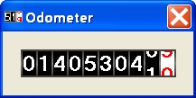



## Odometer

### Description

A odometer usercontrol with settings as digitclors, bordercolor, speed, etc.

Some bugs are fixed.
 
### More Info
 

             |
---                |---
**Submitted On**   |2009-02-20 01:00:00
**By**             |[Ben Vonk](https://github.com/Planet-Source-Code/PSCIndex/blob/master/ByAuthor/ben-vonk.md)
**Level**          |Intermediate
**User Rating**    |4.8 (24 globes from 5 users)
**Compatibility**  |VB 6\.0
**Category**       |[Custom Controls/ Forms/  Menus](https://github.com/Planet-Source-Code/PSCIndex/blob/master/ByCategory/custom-controls-forms-menus__1-4.md)
**World**          |[Visual Basic](https://github.com/Planet-Source-Code/PSCIndex/blob/master/ByWorld/visual-basic.md)
**Archive File**   |[Odometer2144842222009\.zip](https://github.com/Planet-Source-Code/ben-vonk-odometer__1-71793/archive/master.zip)

